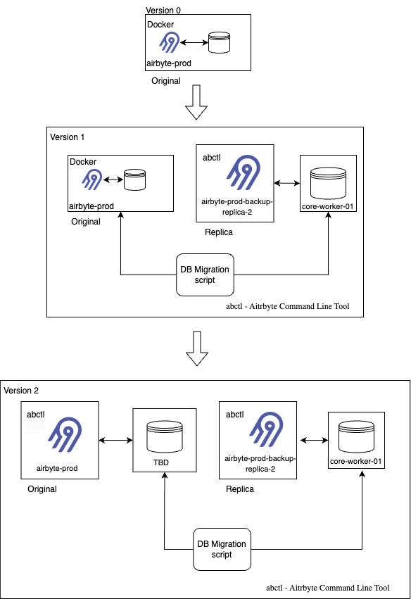

# Airbyte Migration Architecture

This document provides an explanation of the migration process for an Airbyte deployment, from its initial state (Version 0) to two subsequent versions (Version 1 and Version 2). Each version introduces new components and modifications to the architecture, enhancing functionality, resilience, and scalability.

## **Version 0: Initial State**

- **Components:**

  - **Airbyte-prod**: The existing production instance of Airbyte.
  - **Database**: The primary database connected to `airbyte-prod`, responsible for storing configuration and data.

- **Architecture Overview:**
  - This version depicts a single production instance (`airbyte-prod`) directly connected to a database. It represents the initial state of the deployment, where no additional backup or replication mechanisms are in place.

---

## **Version 1: Enhanced Architecture**

- **Objective**: Transition from the initial state by introducing a backup replica and a database migration script.

- **Components:**

  1. **Docker Airbyte-prod**:
     - The production instance is containerized using Docker, interacting with the existing database.
  2. **DB Migration Script**:
     - Facilitates data migration from the current database to a new backup instance.
  3. **Airbyte-prod-backup-replica-2**:
     - A backup replica of `airbyte-prod`, managed using a custom command-line tool named `abctl`.
  4. **core-worker-01**:
     - A core worker service connected to a separate database, supporting the backup replica.

- **Data Flow and Migration Process:**
  - The **DB Migration Script** is used to migrate data from `Docker Airbyte-prod` to `core-worker-01`, ensuring that both the backup replica (`airbyte-prod-backup-replica-2`) and the core worker are synchronized with the production instance.
  - This setup establishes a failover mechanism and provides backup capabilities, enhancing the resilience of the system.

---

## **Version 2: Final Architecture**

- **Objective**: Refine the architecture by restructuring components and integrating new services to improve modularity and fault tolerance.

- **Components:**

  1. **Airbyte-prod (abctl)**:
     - The production instance is now managed using `abctl`, offering better deployment and configuration management compared to Docker.
  2. **TBD (To Be Decided)**:
     - Placeholder for a new database or service planned for integration, acting as an intermediary between `airbyte-prod` and the rest of the architecture.
  3. **Airbyte-prod-backup-replica-2**:
     - Continues to serve as a backup replica, now interacting directly with `TBD` and `core-worker-01`.
  4. **core-worker-01**:
     - Retains its role of handling data, now receiving data via the intermediary (`TBD`) instead of directly from the production instance.

- **Data Flow and Migration Process:**
  - The **DB Migration Script** facilitates data migration between `airbyte-prod`, `TBD`, and `core-worker-01` to maintain synchronization and data consistency.
  - This architecture separates concerns more effectively and improves scalability and fault tolerance.

---

## **Summary**

The diagram and explanation demonstrate the evolution of the Airbyte deployment architecture through three versions, each improving the deployment by introducing backup mechanisms, restructuring components, and refining the database management strategy. The transition to a more modular and fault-tolerant architecture in Version 2 highlights a clear strategy to enhance reliability and maintainability.
